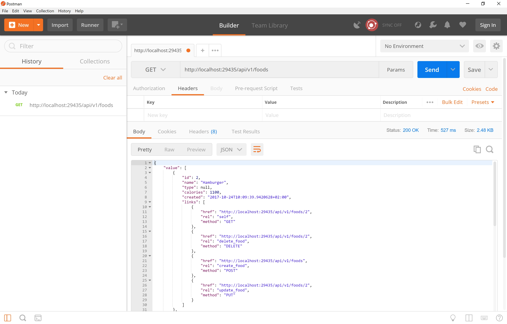
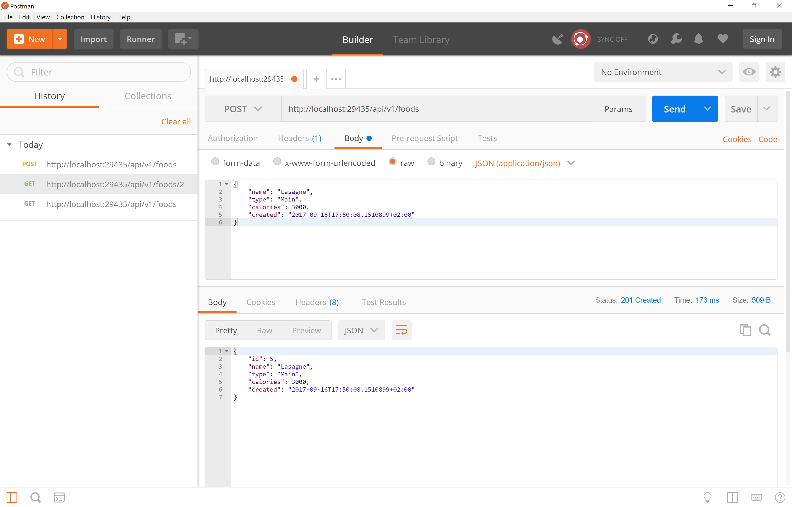
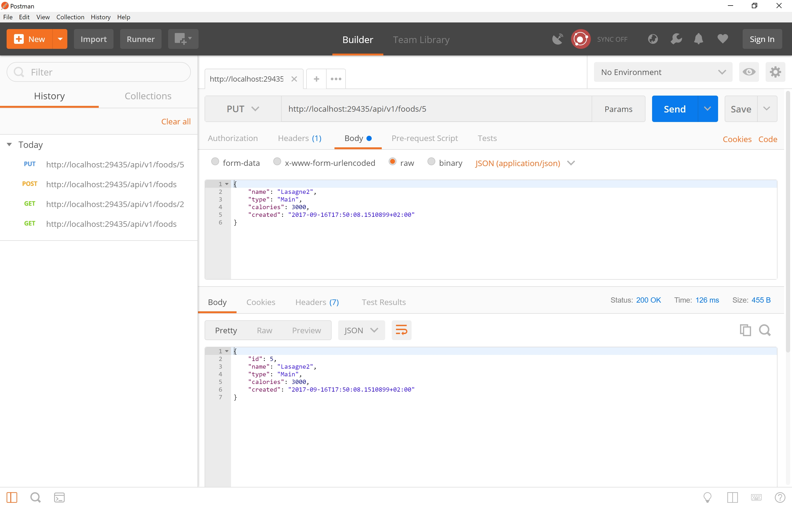

# Dotnet Core WebApi with HATEOAS, Versioning & Swagger, that contains Cake Build Scripts & Kubernetes Deployment ymls

The full stack .NET Core Web API project which contains

##### Infrastructure:

* Cross platform build scripts (Cake) - No additional installations needed
* Docker support
* Kubernetes yml files

##### Architecture:

* HATEOAS
* API Versioning
* Swagger UI
* A controller which is dealing with FoodItems. You can GET/POST/PUT/PATCH and DELETE them.

## Dependencies

Nothing

## Build & Artifacts

* If you are using windows,

```shell
build.ps1
```

* If you are using linux,

```shell
./build.sh
```

* You can just take a look at ```build.cake``` to see whats going on.

## Docker

```shell
docker build . # Create an image using artifacts
```

```shell
docker run -d -p 80:80 yourimageid # Provision & run the container
```

* OR Instant Run:

```shell
docker run -d -p 80:80 boranx/dotnetcorekubernetes
```

Browse : <http://localhost/swagger/#/>

## Kubernetes

```shell
kubectl apply -f kubernetes/aspnetcore-rest-api-pod.yaml # Deploy the pod
```

```shell
kubectl apply -f kubernetes/aspnetcore-rest-api-ks.yaml # Define services
```

## Example API Calls

### Versions

```http://localhost:80/swagger```


### GET all Foods

```http://localhost:80/api/v1/foods```



### GET single food

```http://localhost:80/api/v1/foods/2```


### POST a foodItem

```http://localhost:80/api/v1/foods```

```javascript

  {
      "name": "Lasagne",
      "type": "Main",
      "calories": 3000,
      "created": "2017-09-16T17:50:08.1510899+02:00"
  }

```



### PUT a foodItem

```http://localhost:80/api/v1/foods/5```

```javascript

  {
    "name": "Lasagne2",
    "type": "Main",
    "calories": 3000,
    "created": "2017-09-16T17:50:08.1510899+02:00"
  }

```




### PATCH a foodItem

```http://localhost:80/api/v1/foods/5```

```javascript

  [
    { "op": "replace", "path": "/name", "value": "mynewname" }
  ]

```


### DELETE a foodItem

```http://localhost:80/api/v1/foods/5```


